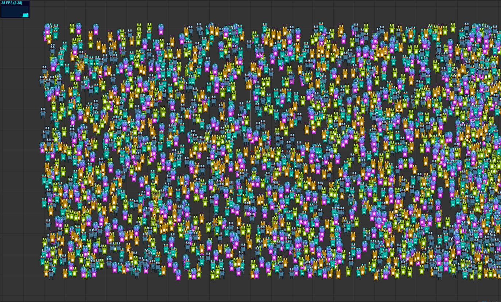
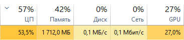
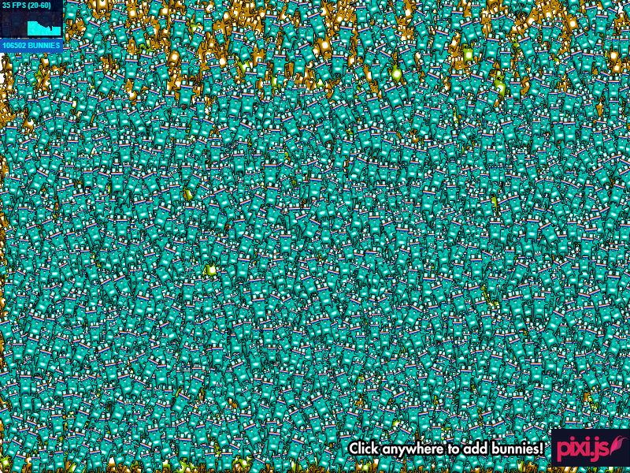
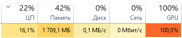

# threejs-bunnymark

**Three.js bunnymark or Three.js vs Pixi.js**

## Task: Load PC until FPS will be equal 35

### PC
- HP ENVY 17 Notebook PC
- Intel Core i5-3230M
- 16GB RAM AMD
- GeForce GT 740M
- Windows 10
- Google Chrome Version 80.0.3987.149

## **Three.js 3000 bunnies**:

> Bunny is sprite

**Load on PC**:

## **Pixi.js 106502 bunnies**:

**Load on PC**:

## Conclusion:

- Pixi.js better then Three.js for work 2D graphics
- Pixi.js better works with GPU then Three.js